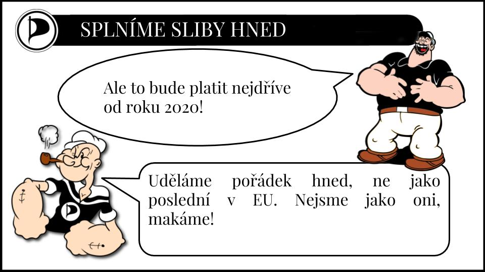
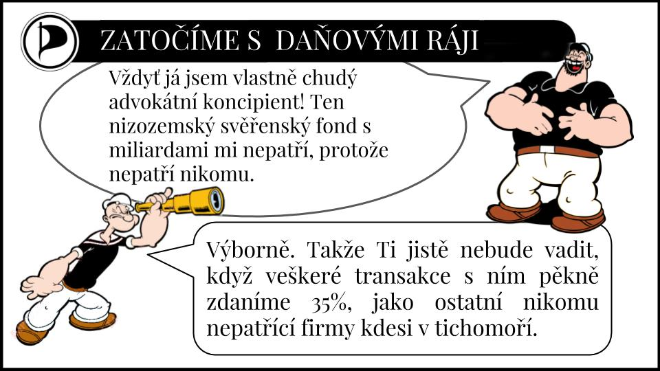
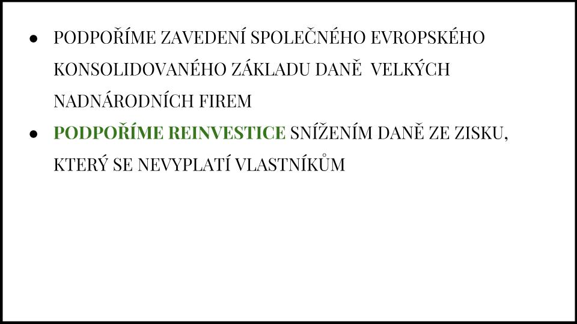

​1. PIRÁTI A DAŇOVÉ OPTIMALIZACE
-------

Daňové prostředí jednoznačně zvýhodňuje velké nadnárodní firmy, které mezinárodní daňovou optimalizací mohou snížit efektivní daňovou sazbu pod 0,5%, zatímco menší česká firma bez přístupu k sofistikovaným nástrojům je zdaněna 19%. Již přes 10 000 původně českých firem přesunulo své sídlo do daňových rájů.  Ty jim kromě nižší daňové zátěže poskytují i ochranu před vyšetřováním korupce a nároky věřitelů. Předchozí ministři financí pro sebe a tyto firmy buďto díry v daňových zákonech vytvářeli, nebo je sami aktivně využívali. Piráti dají daňové správě nástroje, aby mohla firmy využívající daňových rájů tvrdě penalizovat a dohlédnou, aby je efektivně využívala. 

Za prvé je třeba začít naplno využívat možností, které máme. V našem právní řádu je zakotveno pravidlo, že podstata činu má převahu nad formální stránkou. V daňové oblasti to potvrdil i nedávný rozsudek nejvyššího správního soudu. Pokud je hlavním účelem změny struktury firmy přesunout reálně dosahované zisky z podnikání v České republice do cizí nízko zdaněné jurisdikce, má finanční úřad právo vymáhat původní daň v plné výši. Podle tohoto principu pro dodanění velké části korunových dluhopisů není třeba žádná další legislativa, jde pouze o vůli daňové správy konat. Princip potvrzuje i nově uzavřená mnohostraná mezinárodní smlouva proti vyhýbání se daňovým povinnostem, která je nadřazená současným mezinárodním smlouvám o zamezení dvojího zdanění. Pro lepší vymahatelnost i právní jistotu firem je třeba tento princip řádně legislativně upřesnit. Současné ministerstvo financí ale nic takového neplánuje.

Vlády se chlubí, jaké velké průmyslové koncerny do Česka přitáhly, nezveřejňují však, kolik miliard na daních jim za to odpustili. Nejde objektivně posoudit finanční dopad, nejde objektivně posoudit kolik nových pracovních míst vytvořili, a kolik zase zrušili přetáhnutím kvalifikovaných pracovníků z malých a středních firem. Mezi dotacemi vyniká stomilionová injekce na inovační linku Andreje Babiše na výrobu méně slanějšího toastového chleba Penam. Piráti prosadí větší transparentnost investičních (daňových) pobídek v České republice. Zveřejníme informace o závazných daňových rozhodnutích (sweet-heart deals, daňové afirmace) s velkými firmami a veškeré nestandardní daňové úlevy poskytnuté firmám. Investiční pobídky by měly záviset především na kvalitě pracovních míst, které vytvoří, nikoli na jejich počtu. Zaměříme se na lákání malých a středních inovativních firem, nikoliv masové výroby.

Finanční krize přiměla jednotlivé státy, aby se začaly zabývat daňovými optimalizacemi velkých nadnárodních korporací. Namísto aby ČR šla v tomto směru příkladem, zatím především reaguje na minimální standardy stanovené EU. Ta připravila několik směrnic, které budeme muset v nejbližší době implementovat do českého právního řádu. Piráti se nespokojí pouze s nutným minimem, vytvoříme pravidla šitá na míru českým podmínkám. Na prvním místě je třeba rozkrýt anonymní firemní struktury. Plně zveřejníme údaje z rejstříku skutečných vlastníků firem. Nebudeme čekat na schválení Evropské směrnice a předložíme návrh zákona na zavedení povinného veřejného vykazování zisků firem dle jednotlivých zemí v ČR (české public CBCR). Prosadíme rovněž novelu Směrnice proti praní špinavých peněz a zpřísníme podmínky pro ověřování totožnosti u notáře.  

Proti nadnárodním koncernům státy musí postupovat společně, je nutné zastavit tzv. závod na dno ve výši korporátních daní a různých výjimek. Piráti proto podporují zavedení společného konsolidovaného základu daně právnických osob navrhovaný EU (CCCTB), který znesnadňuje daňovou optimalizaci a ve své druhé fázi lépe rozděluje zisk podle místa vzniku. V orgánech Rady Evropské unie budeme usilovat o co nejvýhodnější stanovení parametrů pro rozdělení konsolidované daně z příjmů právnických osob, který bude reflektovat nižší mzdovou úroveň v ČR.
Druhou důležitou Evropskou směrnicí je implementace vybraných doporučení OECD proti daňové optimalizaci. Prvním z nich jsou tzv. CFC pravidla. Po zavedení ve Velké Británii získaly i přezdívku „Google tax“, neboť byly reakcí na chování této firmy. Pravidla stanovují, že zdanění podléhají i zisky dceřiných společností v zahraničí, pokud tamní legislativa umožňuje jejich výrazně nižší efektivní zdanění. EU navrhuje považovat za výrazně nižší zdanění snížení daně o  50%, ale umožňuje i přísnější nastavení kritéria. Například v USA stačí pokles o 10%. České ministerstvo financí se spokojí s 50%, Piráti si vezmou za vzor USA.
Oblíbeným způsobem, kterým korporace optimalizují daně, je pomocí řetězu půjček mezi svými dceřinými společnosti. Tím si svůj zisk snižují splátkami nadměrných úroků. Problém je nyní řešen v ČR zákonem o nízké kapitalizaci. Směrnice volí z ekonomického hlediska vhodnější kritérium, ale s poměrně benevoletní hranicí.  Piráti prosadí nižší hranici pro hodnocení půjček od spřízněných subjektů.

  

Zasadíme se o co nejrychlejší zavedení těchto pravidel, na rozdíl od současného vedení ministerstva, které hodlá využít výjimku pro jejich pozdější uvedení. Nechceme ale jen čekat, až se rozhoupe byrokratická mašinérie EU. Piráti proto prosazují jednostranné zavedení přísnějšího výpočtu daňového základu pro firmy s obratem v ČR nad 10 miliard Kč, nebo obratem skupiny v EU nad 720 miliónů EUR. Ten bude stanovovat přísnější podmínky zamezující umělému snižování zisku pomocí konzultačních a marketingových služeb, licenčních poplatků. 

Druhý největší ghanský pivovar Accra Brewery, který patří do skupiny druhé největší pivovarnické skupiny SABMiller (dříve vlastnící i Plzeňský Prazdroj), v letech 2009 a 2010 i přes rostoucí objem prodeje vykazoval ztrátu. Přitom v těchto letech odvedl platby ve výši 49 milionů eur za licenční poplatky a využívání firemní značky dceřiné firmě sídlící v Nizozemsku či 46 milionů eur za manažerské služby dceřiné firmě ve Švýcarsku. Jde o služby, kde se cena a výše daně pomocí principu tržního odstupu určuje velmi těžko, a je snadné poskytnou fiktivní plnění. Řadí se zde konzultantské, marketingové, managerské a podobné služby. Piráti chtějí obdobně jako u půjček nastavit limity, po jejichž překročení již tyto náklady na tyto služby nebudou daňově uznatelné.

K závěru, že Evropský systém patent boxů nepodporuje inovace, ale spíše ve většině případů pobízí nadnárodní společnosti k přesouvání patentů do zemí s nižším zdaněním, aniž by docházelo k reálnému přesunu vědců či výzkumných aktivit, došla i Evropská komise. V ČR se platby nerezidentům za licenční poplatky daní podle smluv o zamezení dvojího zdanění, popř. srážkovou 15% daní. Např. s Nizozemskem je to 5%, a smlouva byla uzavřena v roce 1974. Naproti tomu s jiným profláklým daňovým rájem Panamou jsme smlouvu uzavřeli 2013, a Lucembursku jsme dokonce tuto sazbu nedávno snížili. Piráti prosazují komplexní reformu této problematiky.

Absurditu chování současného ministerstva ukauzuje i případ českých lodníků, majích pracovní poměr u Nizozemské firmy. Těm daňový úřad sdělil, že mají platit daně v Nizozemí. V platné smlouvě je ale vyjímka pro lodníky, kdy rozhoduje domovský přístav lodi, ne sídlo firmy. Teď požaduje zpětné zaplacení daně za několik let i v Česku. Piráti jim daň odpustí, budeme chránit občany před takovouto buzerací. Budme bránot práva českých občanů pracujících v EU a svobodu pohybu.

Piráti považují za daňové ráje nejen ostrovy v Karibiku, ale i různé právní formy pro firmy v členských státech EU, které buďto umožňují virtuální sídla firem bez skutečné činnosti, anonymní vlastnictví nebo absolutní bankovní tajemství. Zavedeme povinnost podrobně informovat o aktivitách v těchto zemích. Vzhledem k tomu, že primárním účelem těchto firem jsou daňové úniky, budou zpětně nalezené nesrovnalosti vysoce sankcionovány. Výrazně se tím omezí situace, kdy např. v kauze předražené výroby jízdenek pražského Dopravního podniku skončilo 73 milionů korun v neprůhledné společnosti na Britských panenských ostrovech. Omezí se tím situace, kdy představitelé EU zodpovědní za boj proti daňovým únikům jsou zároveň ředitelé těchto firem.

Riziko odhalení skrytých vlastníků zvýšíme legalizací nákupů dat o bankovních účtech v daňových rájích z anonymních zdrojů. Podobně tak učinila Německá vláda v roce 2010, kdy rozhodla o koupi CD za 2,5 milionů euro, kde se nacházely údaje o více než tisíci německých občanech. Daňový únik těchto občanů přesahoval částku 1,2 miliardy eur. Už v době oznámení nákupu tohoto nosiče se ovšem hříšníci začali sami udávat. Postup, kdy policie získává informace o zločinech od informátorů z jejich řad, je nedílnou a běžně využívanou součástí policejní praxe.

Typologie daňových rájů
-----

Mezinárodní obchodní společnosti
----
Klasické daňové ráje sami sebe raději eufemisticky nazývají mezinárodní finanční centra. Pro zařazení na černou listinu pro nás nebude rozhodující, kde firma sídlí, ale zda její právní forma má tyto nežádoucí znaky:
* Firma         není povinna danit své příjmy, pokud neprovádí své podnikatelské aktivity ve státě         registrace. V některých daňových rájích mají virtuální firmy s nulovým zdaněním podnikatelské aktivity dokonce explicitně zakázané, nesmí zde vlastnit ani bankovní účet.                 
* Daňový ráj zachovává anonymitu vlastníků a statutárních orgánů         společnosti. Protože společnosti nejsou povinny platit daně, nejsou formálně evidovány a neexistují jejich veřejné seznamy. Mají možnost vydávání akcií na majitele.        
* Účetnictví firmy nepodléhá kontrole zdejšího finančního úřadu. V některých daňových rájích není povinné ani samotné vedení účetnictví.

Podávat podrobné výkazy bude povinné nejen jako vlastník firmy, ale i jednatelem, členem statutárních orgánu nebo jinou osobou s podílem na řízení firmy. Každá transakce s těmito společnostmi se bude danit 35% srážkovou daní. V případě pokusu o obcházení pomocí třetích firem budou uvalovány vysoké pokuty.

Svěřenské fondy a nadace
-----
S trusty seznámil českou veřejnost Andrej Babiš. Ten svůj majetek předal do formálního vlastnictví svěřenského fondu, řízeného jeho manželkou a dalšími dvěma svěřenci. Formálně tak již majetek nevlastní, ale podle smlouvy jsou tito svěřenci vázaní povinností jednat v jeho zájmu a způsobem, který jim předepsal. Tento „svůj“ majetek může zase kdykoliv nabýt. Tento institut tedy umožňuje právní separaci majetku od jeho vlastníka, čímž jej chrání před věřiteli původního vlastníka, daněmi, finančními úřady a dalšími nepříjemnostmi, které by ho mohli „ohrozit“. Svěřenské fondy by proto také byly na černé listině právních forem.
Velmi podobnou formou je nadace, slovo které má většina veřejnosti spojené s dobročinnou činností. Toho zneužívají země jako Lichtenštejnsko nebo Panama, které jim přidaly všechny vlastnosti vyžadované pro úspěšné ukrývání majetku. Opravdová nadace se od trustu liší maximální transparentností - veřejnou registrací včetně dobročinného účelu a stanov, seznamem největších dárců i obdarovaných, neomezeným trváním, transparentním účtem atd. V opačném případě s nimi budeme zacházet stejně jako se svěřenskými fondy.

Po vzoru Estonska snížíme daň ze zisku, který se nevyplatí vlastníkům.[4] Firmy neodlévají kapitál do daňových rájů jen kvůli obohacení vlastníků. Významným motivem nadnárodních firem je i rychlejší akumulace kapitálu pro další zahraniční akvizice. Podpoříme tím reinvestice firem zpět v ČR. Zároveň tím i usnadníme život drobným podnikatelům, kteří si budou moci snáze našetřit na větší investice. Odstraníme tím absurdní datování faktur ke konci roku nebo nákup zbytných statků, kterými si drobní živnostníci snaží snížit daňový základ.

